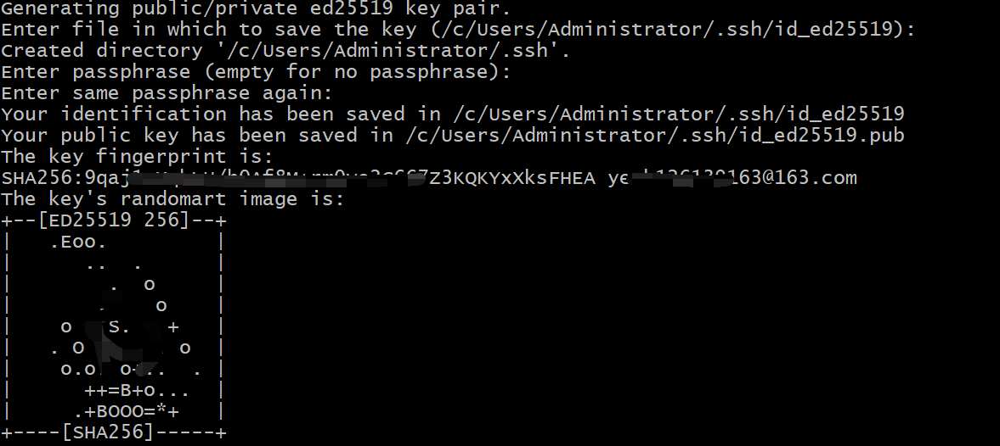
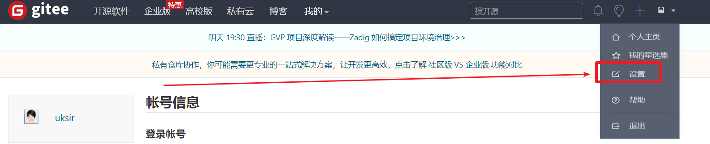
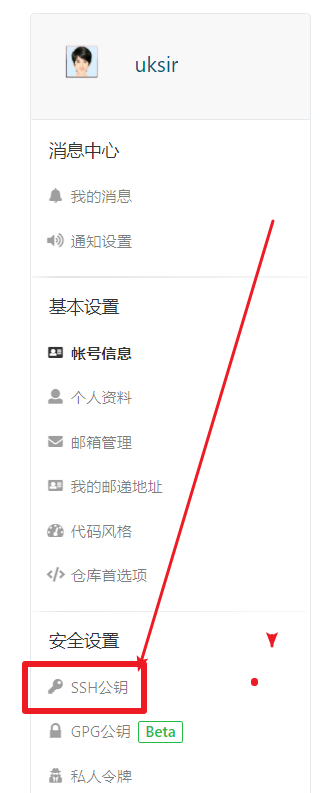
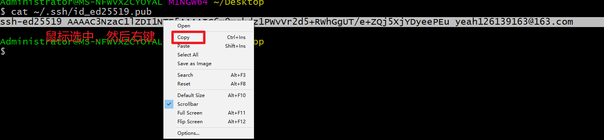
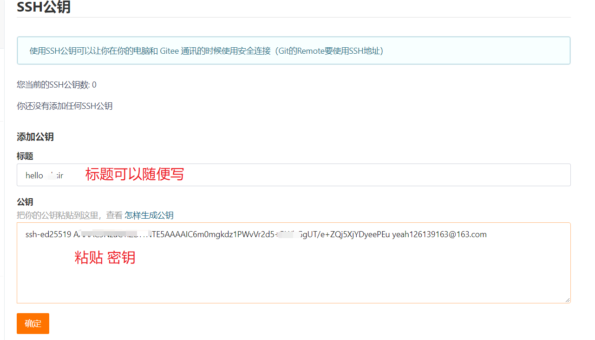
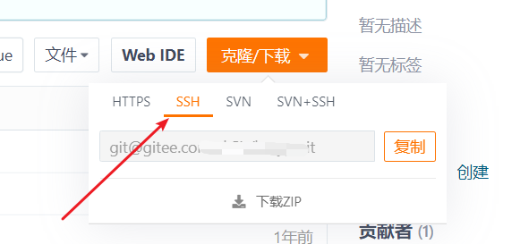

# 设置 SSH 推送和拉取代码

## 背景

一些电脑系统在使用码云的时候，没有自动记录密码功能，就可能会出现频繁要求添加账号和密码的问题。 这个时候可以通过设置 ssh 来解决。

## 什么是 ssh

SSH（Secure Shell，安全外壳）是一种网络安全协议，通过加密和认证机制实现了设备之间的安全保障。传统远程登录或文件传输方式，例如 Telnet，FTP，使用明文传输数据，存在很多的安全隐患。随着人们对网络安全的重视，这种方式已经慢慢不被人接受。SSH 协议通过对网络数据进行加密和验证，在不安全的网络环境中提供了安全的登录和其他安全网络服务。目前 SSH 协议已经被全世界广泛使用，大多数设备都支持 SSH 功能

## 本地生成 ssh 密钥

1. 打开 `git bash` 输入以下命令

   ```
   ssh-keygen -t ed25519 -C 你的邮箱
   ```

2. 然后一直按下回车键 等待以下界面 表示生命密码成功

   

3. 打开你的码云 点击 **设置**

   

4. 选择 **SSH 公钥**

   

5. 回到 **git bash** 输入以下命令 复制你的密钥

   ```
   cat ~/.ssh/id_ed25519.pub
   ```

   ***

   

6. 回到 网页中 粘贴到这里

   

7. 以后，在你的项目中 使用远程仓库时，不能使用 **https**，要修改成 **ssh**

   

8. 如果在已有的项目中 修改协议 可以输入

   ```
   git remote origin set-url 新的协议
   ```
